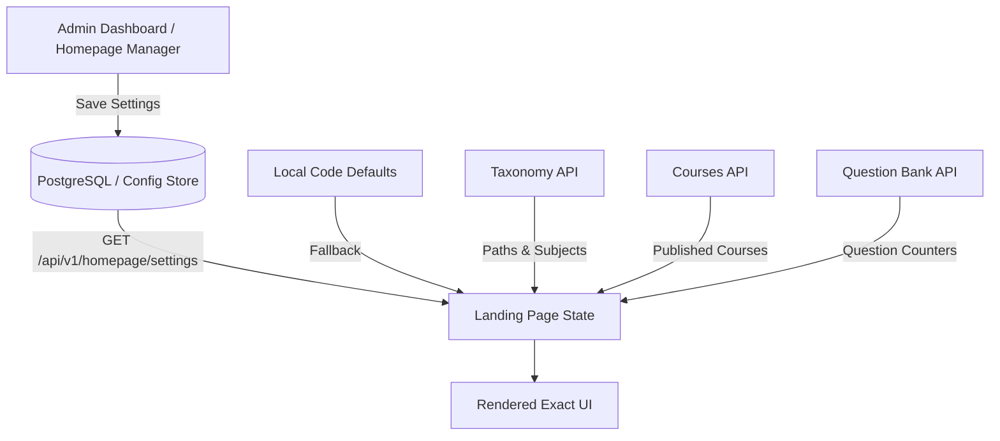

# Dynamic Homepage Behavior & Settings Audit

Comprehensive inventory of all dynamic configuration sources, API data feeds, local defaults, and interactive controls governing the Legacy Landing Page.

---

## 1. Homepage Configuration Architecture

In the legacy architecture, the homepage dynamically merges three tiers of configuration:
1. **Local Safe Defaults (`defaultHomepageSettings`):** Shipped directly with the frontend code to ensure immediate first-paint rendering even if the backend is cold or offline.
2. **Remote Homepage Settings (`HomepageSettings` from DB/API):** Persisted in database and fetched via `api.getHomepageSettings()` / `state.homepageSettings`. Admin can edit these live from the Admin Dashboard (`/admin-dashboard?tab=homepage`).
3. **Live Entity Data Feeds (API Stores):** Active published courses, taxonomy paths, questions count, text lessons, announcements, and testimonial records.

---

## 2. Configuration Breakdown by Section

### A. Brand & Header Settings (`homepageSettings.brand`)
- `logoUrl`: Custom uploaded logo image URL (falls back to platform SVG / text logo).
- `logoAlt`: Accessible alt text for brand logo.
- `logoText`: Primary brand title ("منصة").
- `logoAccentText`: Colored accent title ("المئة").

### B. Hero Section (`homepageSettings.hero`)
- **Texts:**
  - `badgeText`: Pill banner message (Default: "✨ المنصة الأولى للقدرات والتحصيلي").
  - `titlePrefix`: First part of H1 (Default: "حقق").
  - `titleHighlight`: Gradient highlighted word (Default: "المئة في").
  - `titleSuffix`: Trailing part of H1 (Default: "اختباراتك").
  - `description`: Lead paragraph explanation.
- **Colors:**
  - `badgeTextColor`: Custom hex color override for badge.
  - `titlePrefixColor`, `titleHighlightColor`, `titleSuffixColor`: Granular text color customization.
  - `descriptionColor`: Custom text color for description.
  - `primaryCtaColor`, `secondaryCtaColor`, `tertiaryCtaColor`: Button background and border tint overrides.
- **Calls to Action (CTA):**
  - `primaryCtaLabel`: Button label (Default: "ابدأ التدريب مجاناً").
  - `primaryCtaLink`: Target route (Default: `/dashboard`).
  - `secondaryCtaLabel`: Button label (Default: "تصفح مساحة التعلم").
  - `secondaryCtaLink`: Target route (Default: `/courses`).
  - `tertiaryCtaLabel`, `tertiaryCtaLink`: Optional 3rd CTA.
- **Gallery & Carousel Behavior:**
  - `imageUrl`: Primary hero image override.
  - `imageAlt`: Accessibility description.
  - `galleryImages`: String array of up to 10 image URLs for auto-rotating hero gallery.
  - `autoRotateImages`: Boolean toggle to enable/disable automated slide rotation.
  - `rotateIntervalSeconds`: Number between 3 and 60 seconds (Default: 6s).
  - Hover behavior: Pauses interval when mouse enters image frame (`isHeroHovered`).
- **Floating Interactive Cards:**
  - `floatingCardTitle`: Target title (Default: "الهدف اليومي").
  - `floatingCardSubtitle`: Status label (Default: "مستمر بنشاط").
  - `floatingCardProgressLabel`: Progress text (Default: "جاهزية الاختبار").
  - `floatingCardProgressValue`: Progress percentage (Default: "88%").

### C. Live Counters & Metrics Bar (`homepageSettings.stats`)
- Can contain arbitrary number of stat items (first 4 displayed on landing):
  - `mode: 'dynamic'`: Dynamically calculates number from current platform database:
    - `source: 'students'`: Sum of all student enrollments across published courses (`totalStudents`).
    - `source: 'courses'`: Count of currently published courses (`publishedCourses.length`).
    - `source: 'assets'`: Count of questions + published quizzes (`totalQA || totalLearningAssets`).
    - `source: 'rating'`: Average rating across all published courses (`averageRating.toFixed(1)`).
  - `mode: 'manual'`: Displays manual string override defined by admin (`stat.manualValue` e.g. "+15,000", "99.2%").

### D. Featured Educational Paths (`homepageSettings.featuredPathIds`)
- String array of path IDs (`path.id`).
- When populated, only the specified paths are featured on the homepage.
- When empty, displays all active paths from `taxonomy.paths`.
- Visual style selectable per path: `modern`, `minimal`, `playful`, `organic`.

### E. Featured Courses (`homepageSettings.featuredCourseIds`)
- String array of course IDs (`course.id`).
- When populated, showcases up to 3 chosen courses.
- When empty, automatically sorts all published courses by `studentsCount + rating * 100` and displays top 3.
- Shows live prices, discounts, ratings, audience counters, and direct action triggers ("معاينة", "شراء").

### F. Featured Articles (`homepageSettings.featuredArticleLessonIds`)
- String array of lesson IDs (`lesson.id`).
- When configured, pulls published text lessons from the curriculum.
- When empty or offline, falls back to `DEFAULT_PLATFORM_ARTICLES` (10 rich pre-configured articles).
- Interactive trigger: Opens `ArticleReaderModal` directly in-app.

### G. Why Choose Platform Text Overrides (`homepageSettings.sections`)
- `whyChooseTitle`: Section H2 override.
- `whyChooseDescription`: Subtitle paragraph override.

### H. Testimonials (`homepageSettings.testimonials`)
- List of testimonial items: `id`, `name`, `degree` (e.g. "99% قدرات"), `text`, `image`.
- Admin can reorder, add, or edit student feedback.
- Section titles customizable via `sections.testimonialsTitle` and `sections.testimonialsSubtitle`.

### I. Navigation Bar Customization (`homepageSettings.navigation`)
- `showAutoPaths`: Toggle whether taxonomy paths automatically appear as dropdown links in header.
- `moreLabel`: Text for dropdown ("المزيد").
- `items`: Ordered list of navigation links with visibility flags (`visible: true/false`).

---

## 3. Data Flow Diagram

